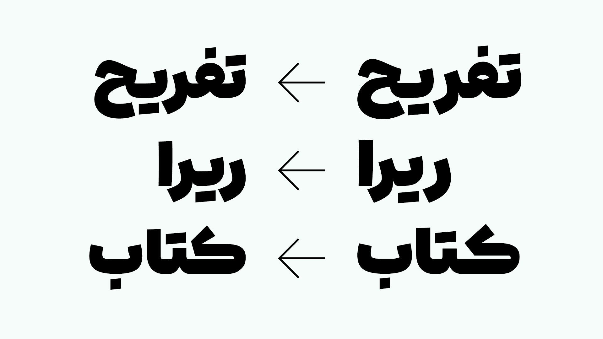
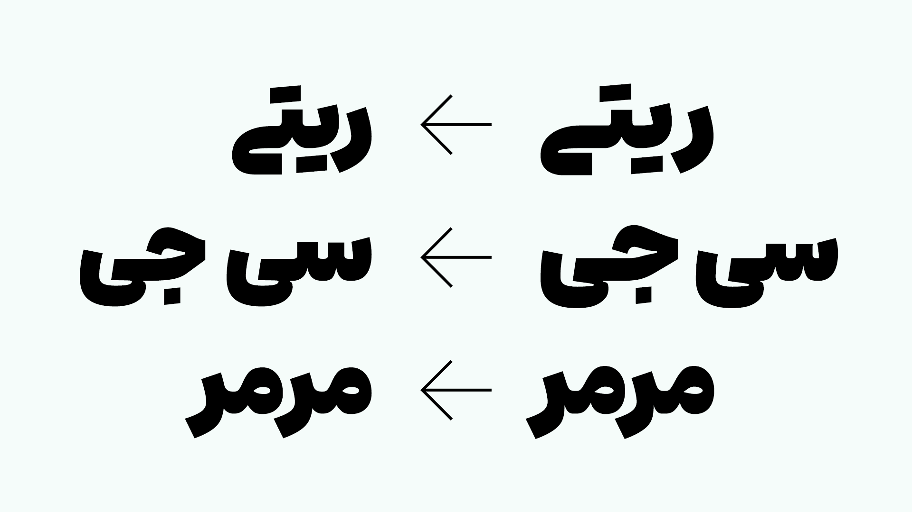
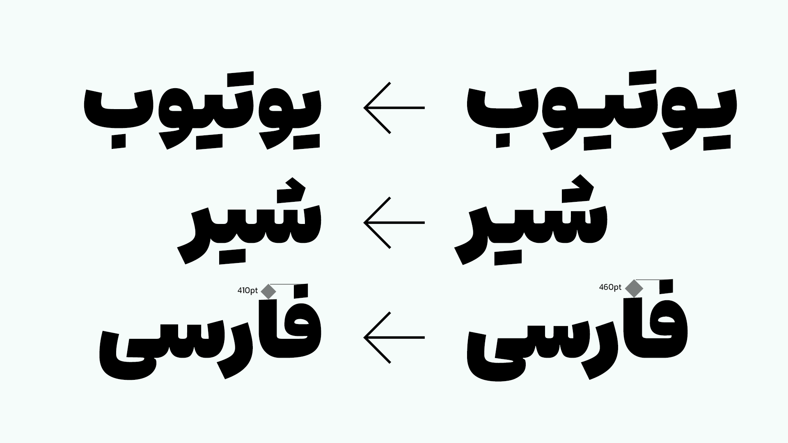
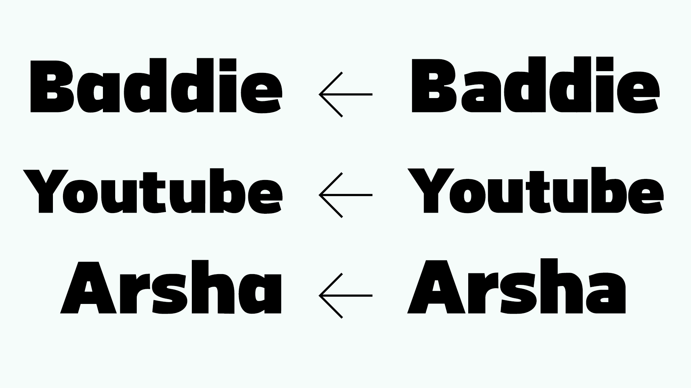
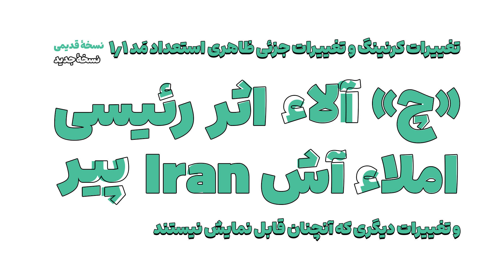

# Estedad Mad Changelog

## ۲٬۰

۱۴ خرداد ۱۴۰۵
در نسخه دوم فونت آریو (استعداد مَد)، شاهد بازسازی کامل بسیاری از قسمت های فونت، و بازبینی باقی قسمت ها هستیم. اسم فونت به آریو تغییر یافت. حجم کار های انجام شده بسیار زیاد است، و بسیاری از این کار ها، مستند نشدند. به همین دلیل به اشاره به سر فصل ها کفایت می‌کنیم.

- طراحی تمام حروف و گلیف ها بازبینی شد

- با توجه به اینکه پایه فونت جدید، از آراد برداشته شده است، شاهد بهبود در تمام بخش های فنی فونت هستیم
-- اضافه شدن و تکمیل گلیف ها و اضافه شدن چند زبان جدید شامل اردو و کوردی
-- جایگزین های شرطی
-- جایگزین های اجباری
-- جایگزین های اختیاری
-- ویژگی های مختلف
- بازسازی و بازبینی تمام کرنینگ ها
- بازسازی تمام اِعراب‌گذاری ها
- کوچک شدن اندازه فونت (بهبود)
- بازبینی متریک ها
- طبیعتاً رفع باگ های مختلف
و تغییرات دیگری، که در اینجا اشاره نشدند.

## ۱,۱

۶ مهر ۱۴۰۳
- تغییر جزئی طراحی بسیاری از حروف
- - تغییر اندازۀ نقاط بعضی حروف
- - تغییر فاصله از کنار بعضی حروف
- - تغییر کلاهک «آ»
- - تغییر جزئی ظاهر تمامی الف ها، لام ها، و الف‌لام ها
- - تغییر شکل جزئی همزه
- - و تغییرات جزئی دیگر
- تغییر اندازۀ فونت
- حذف بعضی از حروف بی‌استفاده
- حذف هینتینگ
- بهینه‌سازی کرنینگ ها
- اضافه کردن گلیف های مربوط به فاصله های خاص، یا نیم‌فاصله
- اصلاح یونیکد حرف «چ»
- تغییر جزئی بعضی حروف انگلیسی، برای هماهنگی بیشتر با حروف فارسی
- اضافه شدن نسخه های «بدون انگلیسی» و «اعداد فارسی»
- اضافه شدن سورس فونت

## ۱.۰
۹ تیر ۱۴۰۳

استعداد مَد منتشر شد.

برای مشاهده تاریخچه فونت استعداد مَد به [این صفحه](https://github.com/MDarvishi5124/Estedad-Mad/CHANGELOG.md) مراجعه نمایید.
