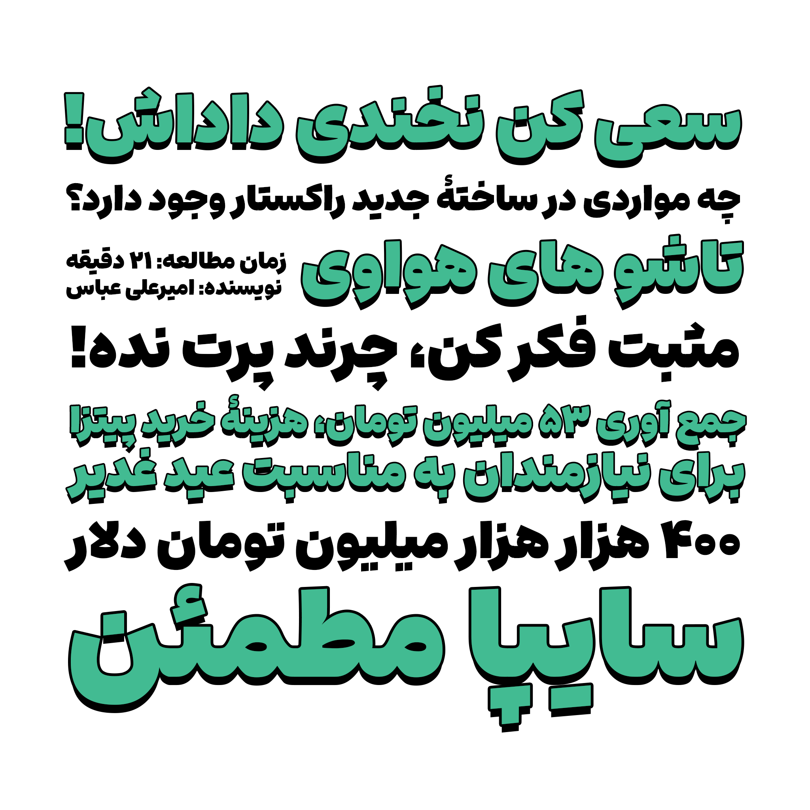

# Ario

<li><a href="https://mohamaddarvishi.ir/Ario/">صفحۀ اصلی پروژه</a></li>
<li><a href="https://mohamaddarvishi.ir/Ario/docs/">راهنما</a></li>
<li><a href="https://mohamaddarvishi.ir/Ario/changelog/">فهرست تغییرات</a></li>
<li><a href="https://mohamaddarvishi.ir/Ario/donate/">حمایت مالی</a></li>

### چه چیز هایی برای انجام وجود دارد؟
- مواردی که گزارش می‌شود

## مشارکت غیرفنی در فونت آریو
- حمایت مالی و معرفی فونت به افراد دیگر
- بنظر می‌آید فونت آریو، در زبان های کوردی و اردو، حروف جایگزین شرطی، به طور کامل و دقیق پیاده سازی نشدند. باید فونت در این زبان ها آزمایش شود
